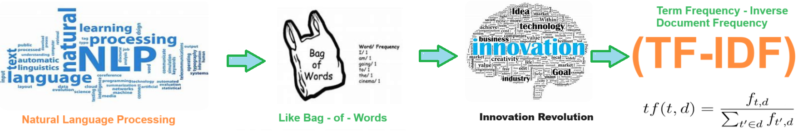

# Term Frequency Inverse Document Frequency - (TF - IDF) 

## TF-IDF helps identify important terms within a document by giving higher weights to terms that are frequent in the document but rare in the corpus

## Description

Welcome to the solution **Term Frequency Inverse Document Frequency** - an example for your projects
 
## Here are some of the main benefits of **TF-IDF**:

1. **Highlighting Important Terms**: TF-IDF helps identify important terms within a document by giving higher weights to terms that are frequent in the document but rare in the corpus. This helps distinguish between terms that are central to the document's content and terms that are common across many documents.

2. **Reducing Noise**: By downweighting terms that are common across the corpus (e.g., stop words like "the", "and", "is"), TF-IDF reduces the influence of noise in the data and focuses attention on terms that are more meaningful and informative.

3. **Improving Search Relevance**: TF-IDF is commonly used in search engines to rank documents based on their relevance to a user query. Documents containing terms that are both relevant to the query and unique within the corpus are given higher rankings.

4. **Handling Varied Document Lengths**: TF-IDF accounts for variations in document lengths by normalizing the term frequency by the total number of terms in the document. This ensures that longer documents do not disproportionately influence the importance of terms.

5. **Flexibility and Interpretability**: TF-IDF is a simple and intuitive measure that can be easily implemented and understood. It provides a clear indication of the importance of terms within documents, making it valuable for tasks such as document classification, clustering, and summarization.

Overall, TF-IDF is a powerful technique for analyzing text data and extracting meaningful insights by identifying and prioritizing terms based on their relevance and uniqueness within a corpus.

   
## Features
- Easy to understand and use  
- Easily Configurable 
- Quickly start your project with pre-built templates
- Its Fast and Automated
    
## Notebook Features
- Self Documenting 
- Self Testing 
- Easily Configurable
- Includes Talking Code - The code explains itself
- Self Logging 
- Self Debugging 
- Low Code - or - No Code
- Educational 
    

    